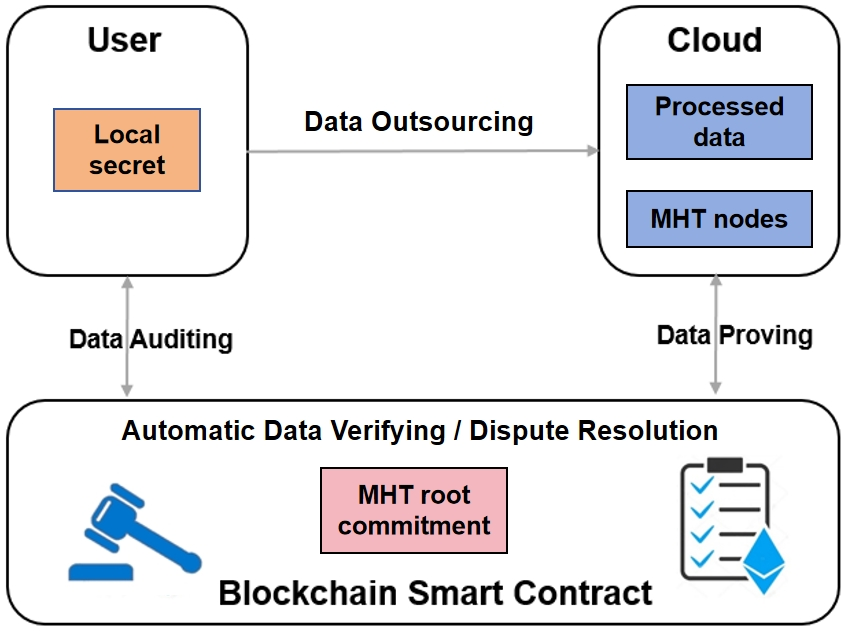

# Blockchain assisted low-onchain-cost cloud storage auditing

With the large-scale application of cloud storage services, the security of stored data is valued by individuals and companies.
To enhance outsourced data security, cloud storage auditing is able to verify the integrity of the data without downloading all the data attracts research efforts.
On the meanwhile, blockchain is also emerging due to its intrinsic trustfulness and the useful smart contract feature.
This work leverages blockchain to enable better cloud storage auditing that supports efficient user compensation, which in the long guarantees both user and cloud interests.

## What we do


To solve the usability issue, we propose an efficient smart-contract-based cloud storage auditing protocol.
The protocol only requires one signature verification for integrity auditing.
The signature verification is also natively supported by Ethereum, which makes the proposed protocol very efficient on smart contract cost.
The proposed protocol also supports automatic user compensation and fair dispute arbitration to effectively prevent malicious participants.

## Usage
### Installation
Our prototype is written in golang. Make sure that version 1.19 of golang is installed. One can download the code by git clone. Run the command line as shown below.

```text
git clone https://github.com/szu-security-group/cloud-storage-auditing-automatic-compensation.git
cd ${your_path}$
go run .

```

### Project layout
Let's briefly introduce the layout of the project. 
```text
contracts
    autoPay.sol
core
    autoPA.go
    utils.go
    mht.go
data
    data.go
main.go
```

The `main.go` is a complete demo of the proposed protocol.

`contract` contains the solidity files of the smart contract. 

`core\autoPA.go` includes each algorithm of the protocol. 

`data` are simple data processing methods collection.

### Deploy contract
We provide two methods to test the contract.
The first one is `remix online compiler`. One can push files in `contract` to `remix` and deploy it and call the function easily. The operational details of the protocol can be clearly displayed, e.g., gas cost.

The second method is slightly more complicated. One can use the `api` way to make the go program connect to blockchain and run the function. `Rinkeby` is a public test blockchain and `Ganache` is a private personal test blockchain platform. One can create a wallet through `MetaMask`; deploy smart contracts on blockchain; and finally test the operation of the protocol and its performance.
